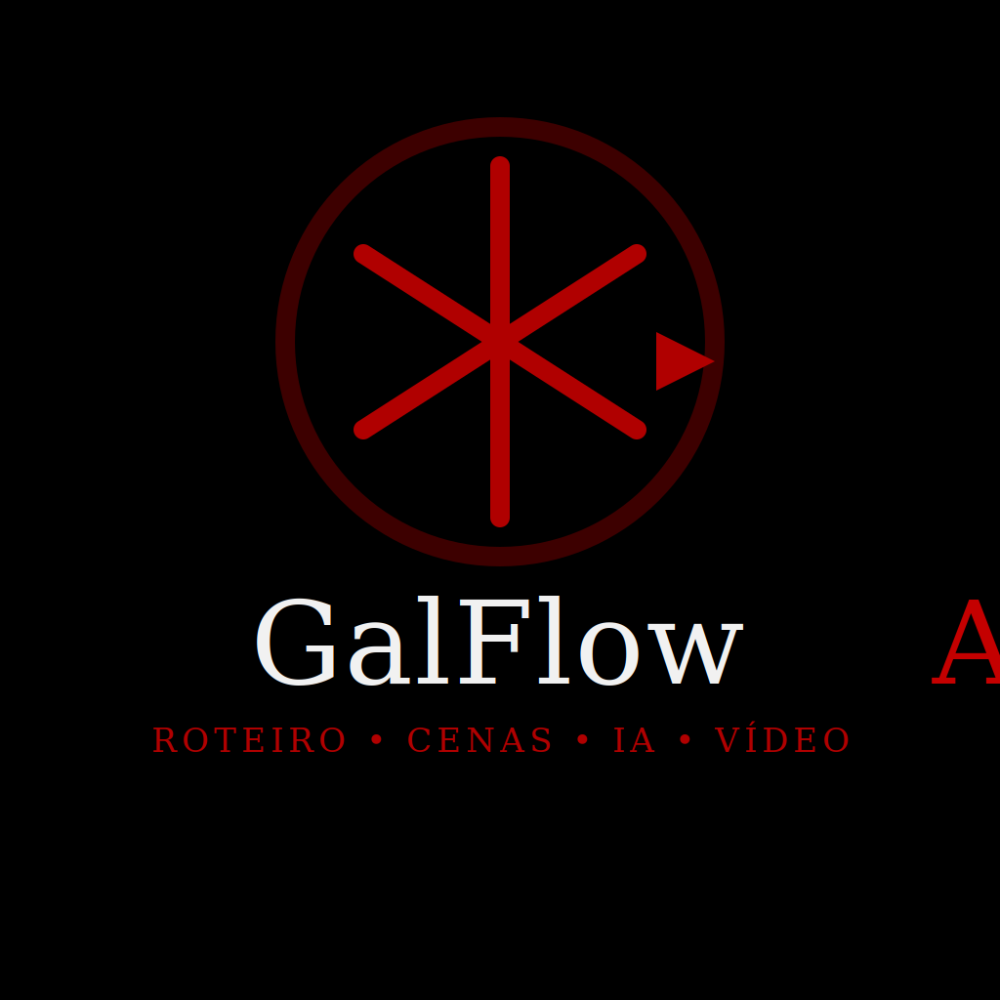
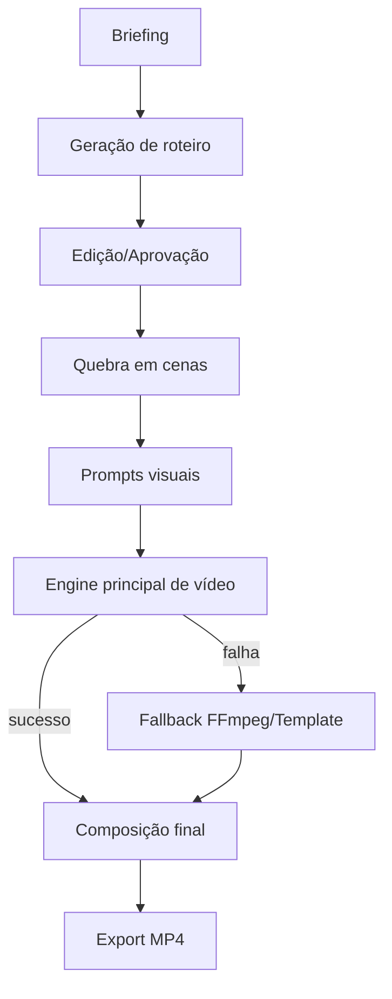
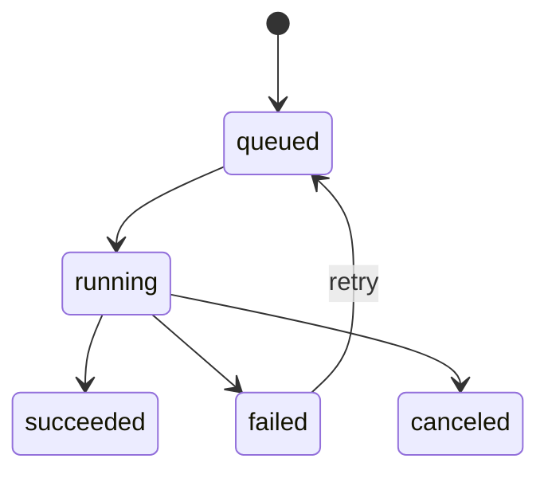
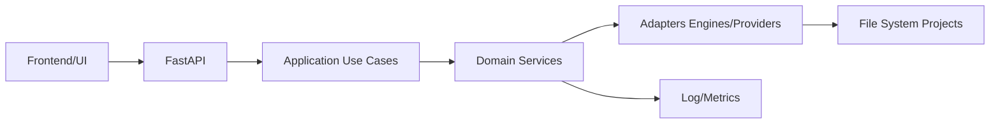

# GalFlowAI

<p align="center">
  
</p>

<p align="center">
  <strong>Roteiro → Cenas → IA → Vídeo</strong><br/>
  Plataforma <strong>local-first</strong> para geração de vídeos comerciais com IA, fallback robusto e foco em operação offline.
</p>

---

## Sumário
- [Visão do Produto](#visão-do-produto)
- [Princípios de Arquitetura](#princípios-de-arquitetura)
- [Status Real do Projeto](#status-real-do-projeto)
- [Fluxo do Sistema](#fluxo-do-sistema)
- [Arquitetura Técnica](#arquitetura-técnica)
- [Começando em 5 minutos](#começando-em-5-minutos)
- [Execução e Operação](#execução-e-operação)
- [Qualidade e Testes](#qualidade-e-testes)
- [Roadmap objetivo](#roadmap-objetivo)
- [Governança de documentação](#governança-de-documentação)

---

## Visão do Produto

**GalFlowAI** é uma plataforma para criação de comerciais curtos com IA rodando localmente, priorizando:

- privacidade e autonomia (sem dependência obrigatória de API paga);
- resiliência operacional via fallback;
- iteração rápida de roteiro e cenas;
- rastreabilidade técnica do pipeline.

### Naming oficial
- **Produto e marca:** `GalFlowAI`
- **Repositório:** `galFlowAI`
- Referências legadas (ex.: FlowForgeAI) devem aparecer apenas em contexto histórico.

---

## Princípios de Arquitetura

1. **Local-first**: funcional mesmo sem cloud.
2. **Fail-safe por fallback**: fluxo não deve parar em falha de engine principal.
3. **Evolução incremental**: mudanças pequenas, testáveis e reversíveis.
4. **Contrato explícito**: API, erros e estado de job devem ser previsíveis.
5. **Documentação viva**: README (entrada), BACKLOG (execução), ROADMAP (direção).

---

## Status Real do Projeto

### ✅ Já implementado
- Pipeline base de criação: roteiro → cenas → render/finalização.
- Base FastAPI + UI local.
- Fallback operacional em cadeia para não interromper geração.
- Estrutura inicial de use cases na camada de aplicação.
- Job queue com mutex (H11 concluído: 16 testes passando).
- Metrics & Monitoring (H12 concluído: 10 testes passando).
- Logs via API (H13 concluído: 11 testes passando).
- Documentação técnica segmentada em `docs/`.

### 🟨 Em evolução (não concluído)
- Contratos de API versionados e testados de ponta a ponta.
- Padronização formal de envelope de erro.
- Métricas operacionais e observabilidade premium.

---

## Fluxo do Sistema



### Estados de alto nível



---

## Arquitetura Técnica



### Estrutura de diretórios (resumo)

```text
app/                  # API + camadas de aplicação/serviços
frontend/             # interface e assets
docs/                 # documentação técnica por domínio
tests/                # testes unitários/integrados
state/                # estado operacional e checkpoints
scripts/              # automações operacionais
```

---

## Começando em 5 minutos

## 1) Ambiente
```bash
python -m venv .venv
source .venv/bin/activate   # Linux/macOS
# .venv\Scripts\activate   # Windows PowerShell
pip install -r requirements.txt
```

## 2) Subir aplicação
```bash
python run_galFlowAI.py
```

## 3) Rodar testes básicos
```bash
pytest -q
```

---

## Execução e Operação

- **Entrada recomendada:** `run_galFlowAI.py`
- **Documentação operacional:** `docs/VIDEO_PIPELINE.md`, `docs/TROUBLESHOOTING.md`
- **Configuração de provedores locais:** `docs/PROVIDERS_SETUP.md`

---

## Qualidade e Testes

### Estratégia
- testes unitários para regras de negócio;
- testes de contrato para API crítica;
- testes de fallback para cenários de falha;
- smoke de fluxo local-first.

### Referências
- Plano de QA: `qa/QA_TEST_PLAN.md`
- Backlog técnico: `BACKLOG.md`

---

## Roadmap objetivo

Curto prazo:
1. Contrato de API (`/api/v1`) + testes de contrato.
2. Envelope padrão de erros.
3. Fila local de jobs com estados formais.

Médio prazo:
1. Logs estruturados e métricas por etapa/provider.
2. observabilidade operacional com diagnóstico rápido.

---

## Governança de documentação

Para cada PR:
- atualizar docs impactadas no mesmo PR;
- distinguir claramente **implementado** vs **planejado**;
- incluir evidência (teste, log, endpoint ou artefato);
- manter naming oficial **GalFlowAI**.

---

Se algo neste README divergir do comportamento real, abra issue e referencie arquivo/linha para correção rápida.
