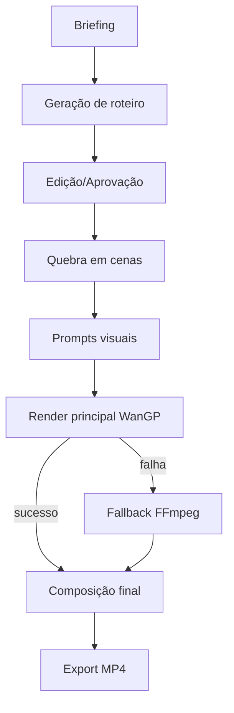
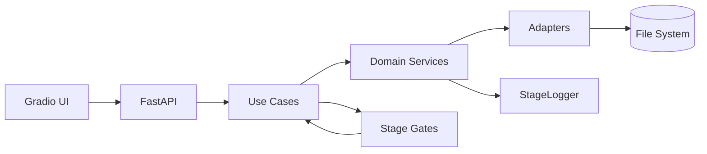

# GalFlowAI

<p align="center">
  
  <br/>
  <strong>Roteiro → Cenas → IA → Vídeo</strong>
  <br/>
  <em>Local-first · Fallback-first · Offline-ready</em>
</p>

<p align="center">
  
  
  
  
</p>

---

## Índice

- [O que é](#o-que-é)
- [Quick Start](#quick-start)
- [Pipeline](#pipeline)
- [Stage Gates](#stage-gates)
- [Prompt Reviewer](#prompt-reviewer)
- [CLI de Qualidade](#cli-de-qualidade)
- [LLM Providers](#llm-providers)
- [Testes](#testes)
- [Docs](#docs)
- [Arquitetura](#arquitetura)
- [Riscos](#riscos)

---

## O que é

GalFlowAI gera **comerciais de vídeo curtos** com IA 100% local. Do briefing ao MP4 sem depender de API paga ou cloud.

### Capacidades

| Funcionalidade | Status |
|---|---|
| Geração de roteiro por IA local | ✅ 6 providers |
| Edição, versões, aprovação | ✅ Com stage gates |
| Quebra em cenas + prompts visuais | ✅ |
| TTS com fallback silencioso | ✅ |
| Render WanGP + FFmpeg fallback | ✅ |
| Quality gates por etapa | ✅ Novo |
| Prompt lint automático | ✅ Novo |
| Dashboard de logs em tempo real | ✅ |
| API REST `/api/v1/` | ✅ |
| Queue com ledger SQLite | ✅ |
| Quality CLI (`scripts/quality_check.py`) | ✅ Novo |

---

## Quick Start

```bash
# Ativar ambiente
K:\AI_VIDEO_COMERCIAL_STUDIO\envs\studio\Scripts\activate

# Iniciar UI
scripts\start_GalFlowAI_standard.bat
# → http://127.0.0.1:7860

# Testes
pytest -q
# → 1165 passed
```

---

## Pipeline



**7 etapas** orquestradas por `VideoGenerationPipeline` com use cases independentes, logging estruturado e erros rastreáveis.

---

## Stage Gates

Gates formais que bloqueiam etapas se pré-condições não forem atendidas:

| Gate | Stage | O que valida |
|------|-------|-------------|
| `ProjectExistsGate` | script | Diretório do projeto existe |
| `BriefingNotEmptyGate` | script | Briefing não está vazio |
| `ScriptGeneratedGate` | approval | `script_draft.md` existe |
| `ScriptApprovedGate` | scenes | `script_approved.md` existe |
| `ScenesExistGate` | prompts | `scenes.json` existe |
| `PromptsExistGate` | render | Prompt files existem |
| `RenderedScenesGate` | concat | Pelo menos 1 cena renderizada |

Atualmente **2 gates integrados ao pipeline**: SCRIPT (project + briefing) e CONCAT (cenas renderizadas). Demais disponíveis via CLI.

```bash
py scripts/quality_check.py meu_projeto --gate scenes
py scripts/quality_check.py meu_projeto --all
```

---

## Prompt Reviewer

Lint automático de prompts com 8 regras e score (0.0–1.0):

| Regra | Severidade | O que detecta |
|-------|-----------|---------------|
| `prompt_pos_not_empty` | ERROR | Prompt vazio |
| `prompt_neg_not_empty` | WARNING | Negative prompt vazio |
| `prompt_too_short` | WARNING | < 20 caracteres |
| `prompt_too_long` | INFO | > 2000 caracteres |
| `no_placeholder_text` | ERROR | "DESCRIÇÃO", "TODO", placeholders |
| `has_quality_keywords_pos` | INFO | Prompt sem termos de qualidade |
| `neg_has_quality_terms` | WARNING | Negative sem "blurry, low quality" |
| `neg_has_both_languages` | WARNING | Faltam termos PT ou EN |

```python
from app.domain.prompt_reviewer import review_scene_prompts

report = review_scene_prompts(scenes)
# → scene_count, average_score, total_violations, scene_reviews
```

---

## CLI de Qualidade

```bash
# Verificar gates de um projeto
py scripts/quality_check.py meu_projeto

# Gate específico
py scripts/quality_check.py meu_projeto --gate scenes

# Revisar prompts
py scripts/quality_check.py meu_projeto --review-prompts

# Exportar relatório completo como JSON
py scripts/quality_check.py meu_projeto --export
# → projects/meu_projeto/quality/quality_report.json

# Listar todos os gates registrados
py scripts/quality_check.py --list-gates
```

---

## LLM Providers

| Provider | Status | Fallback |
|----------|--------|----------|
| TemplateProvider | ✅ Always | Fallback universal |
| GPT4All (orca-mini-3b) | ✅ Local | Template |
| LM Studio | ✅ Local | Template |
| KoboldCpp | ✅ Local | Template |
| LlamaCpp | ✅ Local | Template |
| Ollama | ⚡ Opcional | Template |

---

## Testes

```bash
pytest -q            # 1165 testes, full suite
pytest tests/ -v     # verbose
pytest --cov=app     # cobertura (70%)
```

- **26 testes** para Stage Gates
- **43 testes** para Prompt Reviewer
- **4+** E2E mockados para fallback WanGP→FFmpeg
- Zero dependência de GPU nos testes

---

## Docs

| Documento | Conteúdo |
|---|---|
| `README.md` | Esta página → entrada única |
| `docs/project-control/` | Backlog, status, daily log, DoR/DoD |
| `docs/reference/` | Fonte de verdade do produto, matriz de preservação |
| `artifacts/qa/` | Testes smoke, 60 críticas técnicas, matriz runtime |

---

## Arquitetura



### Estrutura

```
app/
├── pipeline/           # Orquestração + Gates + JobState
│   ├── video_generation_pipeline.py
│   ├── stage_gate.py           # ← Novo
│   ├── job_state.py
│   └── job_ledger.py
├── domain/             # Regras de negócio
│   ├── prompt_reviewer.py      # ← Novo
│   ├── stage_logger.py
│   └── scene_contract.py
├── application/        # Use cases
├── adapters/           # WanGP, FFmpeg, TTS, LLM providers
└── ui/                 # Gradio (moderno)
scripts/
├── quality_check.py    # ← Novo
└── lint_check.py       # ← Novo
tests/                  # 1165 testes
```

---

## Riscos

| Risco | Impacto | Mitigação |
|---|---|---|
| VRAM 6GB limitada (GTX 1660 Super) | Alto | Modelo 1.3B, preset seguro, mutex |
| Fallback FFmpeg pode falhar | Médio | Testes E2E, validação de paths |
| Drift docs/código | Médio | Atualização mandatória em PR |
| Logs sem rotação | Baixo | Compactação periódica |

---

## Licença

MIT — uso livre, modificação e distribuição permitidas.

---

<p align="center">
  
  <br/>
  <em>Feito para rodar onde você está.</em>
</p>
