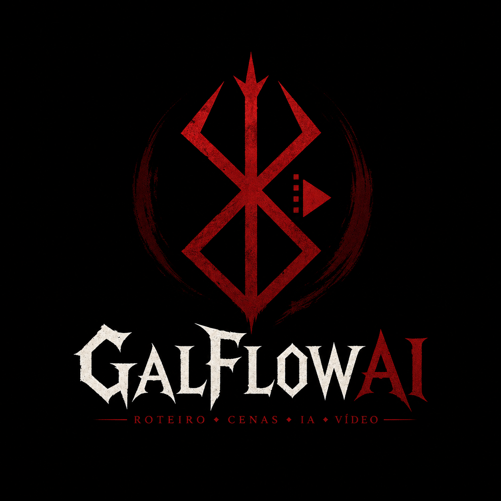
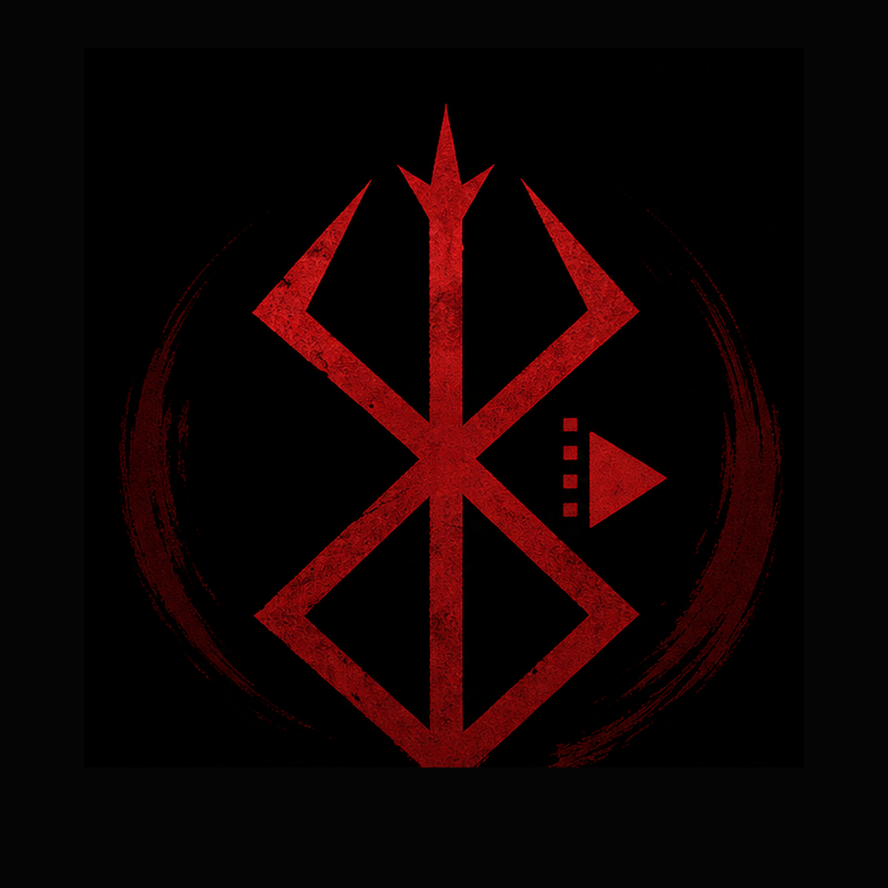
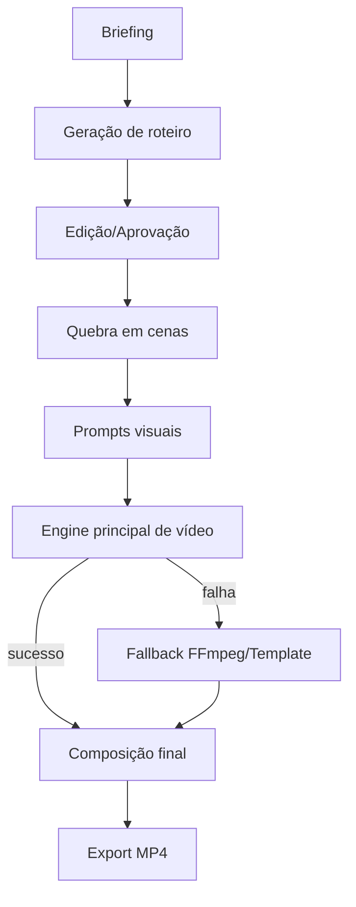
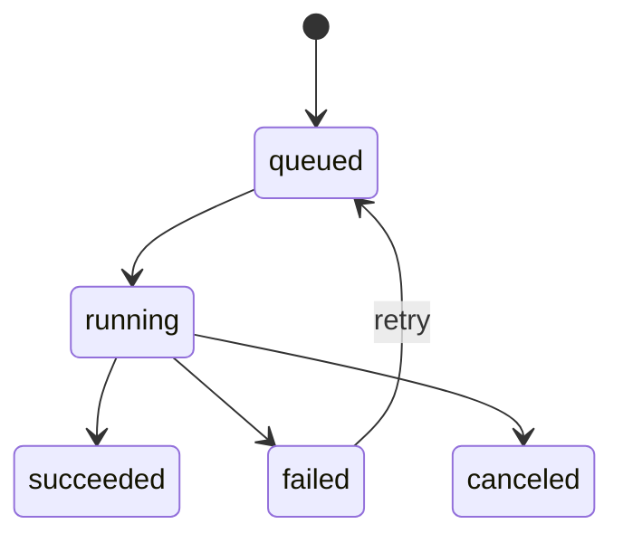
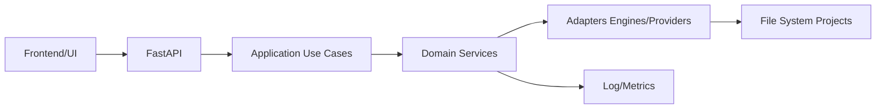

# GalFlowAI

<p align="center">
  
</p>

<p align="center">
  
</p>

<p align="center">
  <strong>Roteiro → Cenas → IA → Vídeo</strong><br/>
  Plataforma <strong>local-first</strong> para geração de vídeos comerciais com IA, fallback robusto e foco em operação offline.
</p>

---

## Sumário
### 🎯 Trilha Operação (como usar)
- [Começando em 5 minutos](#começando-em-5-minutos)
- [Onboarding Rápido](#onboarding-rápido)
- [Execução e Operação](#execução-e-operação)
- [Riscos Ativos](#riscos-ativos)
- [Qualidade e Testes](#qualidade-e-testes)

### 🏗️ Trilha Arquitetura (como evoluir)
- [Visão do Produto](#visão-do-produto)
- [Princípios de Arquitetura](#princípios-de-arquitetura)
- [Status Real do Projeto](#status-real-do-projeto)
- [Fluxo do Sistema](#fluxo-do-sistema)
- [Arquitetura Técnica](#arquitetura-técnica)
- [Roadmap objetivo](#roadmap-objetivo)
- [Governança de documentação](#governança-de-documentação)

---

## Visão do Produto

**GalFlowAI** é uma plataforma para criação de comerciais curtos com IA rodando localmente, priorizando:

- privacidade e autonomia (sem dependência obrigatória de API paga);
- resiliência operacional via fallback;
- iteração rápida de roteiro e cenas;
- rastreabilidade técnica do pipeline.

### Naming oficial
- **Produto e marca:** `GalFlowAI`
- **Repositório:** `galFlowAI`
- **Logos:** `galflowai_logo_master.png` (logo principal), `galflowai_app_icon.png` (ícone)
- Referências legadas (ex.: FlowForgeAI) devem aparecer apenas em contexto histórico.

---

## Princípios de Arquitetura

1. **Local-first**: funcional mesmo sem cloud.
2. **Fail-safe por fallback**: fluxo não deve parar em falha de engine principal.
3. **Evolução incremental**: mudanças pequenas, testáveis e reversíveis.
4. **Contrato explícito**: API, erros e estado de job devem ser previsíveis.
5. **Documentação viva**: README (entrada), BACKLOG (execução), ROADMAP (direção).

---

## Status Real do Projeto

### ✅ Já implementado
- Pipeline base de criação: roteiro → cenas → render/finalização.
- Base FastAPI + UI local (Gradio em 127.0.0.1:7860).
- Fallback operacional em cadeia para não interromper geração.
- Estrutura completa de use cases na camada de aplicação (25+ use cases).
- Job queue com mutex (H11 concluído: 16 testes passando).
- Metrics & Monitoring (H12 concluído: 10 testes passando).
- Logs via API (H13 concluído: 11 testes passando).
- Prompt Context Pack (H14 concluído: 12 testes passando).
- Script Quality & Commercial (H15 concluído: 13 testes passando).
- Advanced Script Editing (H16 concluído: 11 testes passando).
- Visual Consistency (H17 concluído: 13 testes passando).
- Advanced Observability (H18 concluído: 6 testes passando).
- Documentação técnica segmentada em `docs/`.
- **Total: 314 testes coletados, 84+ novos testes H11-H18 (100% pass).**
- **Padronização de erros:** formato "CAUSA | CORREÇÃO" implementado.
- **Ambiente K-only:** sem dependências de C:, todos os caminhos em K:.

### 🟨 Em evolução (não concluído)
- Contratos de API versionados e testados de ponta a ponta.
- Testes E2E para fallback FFmpeg.
- Métricas operacionais e observabilidade premium.
- Backup sistêmico automatizado.

---

## Fluxo do Sistema



### Estados de alto nível



---

## Arquitetura Técnica



### Estrutura de diretórios (resumo)

```text
app/                  # API + camadas de aplicação/serviços
frontend/             # interface e assets
docs/                 # documentação técnica por domínio
tests/                # testes unitários/integrados
state/                # estado operacional e checkpoints
scripts/              # automações operacionais
galflowai_logo_master.png  # Logo principal
galflowai_app_icon.png     # Ícone do app
```

---

## Começando em 5 minutos

### 1) Ambiente
```bash
# Usar ambiente existente (recomendado)
K:\AI_VIDEO_COMERCIAL_STUDIO\envs\studio\Scripts\activate
```

### 2) Subir aplicação
```bash
# Via BAT padrão (configura todas as variáveis)
scripts\start_flowforgeai_standard.bat

# Ou diretamente
python run_galFlowAI.py
```

### 3) Rodar testes básicos
```bash
pytest -q
# Total: 314 testes coletados
```

---

## Execução e Operação

- **Entrada recomendada:** `run_galFlowAI.py`
- **Documentação operacional:** `docs/VIDEO_PIPELINE.md`, `docs/TROUBLESHOOTING.md`
- **Configuração de provedores locais:** `docs/PROVIDERS_SETUP.md`
- **Variáveis obrigatórias:** configuradas via `scripts/start_flowforgeai_standard.bat`
  - PIP_CACHE_DIR, HF_HOME, TORCH_HOME, XDG_CACHE_HOME, TEMP, TMP, OLLAMA_MODELS, GIT_PYTHON_GIT_EXECUTABLE

---

## Qualidade e Testes

### Estratégia
- testes unitários para regras de negócio;
- testes de contrato para API crítica;
- testes de fallback para cenários de falha;
- smoke de fluxo local-first.

### Cobertura atual
- **314 testes coletados** (pytest)
- **84+ novos testes H11-H18** (100% pass)
- Use cases seguem padrão 3 pontos: Validate → Execute → Return

### Referências
- Plano de QA: `qa/QA_TEST_PLAN.md`
- Backlog técnico: `BACKLOG.md`
- Roadmap: `ROADMAP.md`

---

## Roadmap objetivo

### Curto prazo (H19-H20)
1. Contrato de API (`/api/v1`) + testes de contrato.
2. Envelope padrão de erros (CAUSA | CORREÇÃO).
3. Fila local de jobs com estados formais.

### Médio prazo
1. Logs estruturados e métricas por etapa/provider.
2. Observabilidade operacional com diagnóstico rápido.
3. Testes E2E completos.

### Longo prazo
1. Integração com WanGP/Wan2GP 1.3B (motor principal).
2. FramePack como motor experimental.
3. Montagem FFmpeg como prioridade.

---

## Governança de documentação

Para cada PR:
- atualizar docs impactadas no mesmo PR;
- distinguir claramente **implementado** vs **planejado**;
- incluir evidência (teste, log, endpoint ou artefato);
- manter naming oficial **GalFlowAI**;
- usar logos oficiais (`galflowai_logo_master.png`, `galflowai_app_icon.png`).

---

## Trilhas de Documentação

### 🎯 Trilha Operação (como usar o GalFlowAI)
- **Começando:** [Começando em 5 minutos](#começando-em-5-minutos)
- **Onboarding:** [Onboarding Rápido](#onboarding-rápido)
- **Execução:** [Execução e Operação](#execução-e-operação)
- **Troubleshooting:** `docs/TROUBLESHOOTING.md`
- **Provedores LLM:** `docs/PROVIDERS_SETUP.md`
- **Instalação GPT4All:** `docs/INSTALAR_GPT4ALL_K.md`
- **Instalação KoboldCPP:** `docs/INSTALAR_KOBOLDCPP_K.md`
- **Instalação LLaMA.cpp:** `docs/INSTALAR_LLAMACPP_K.md`
- **Instalação LM Studio:** `docs/INSTALAR_LM_STUDIO_K.md`

### 🏗️ Trilha Arquitetura (como evoluir o GalFlowAI)
- **Visão:** [Visão do Produto](#visão-do-produto)
- **Princípios:** [Princípios de Arquitetura](#princípios-de-arquitetura)
- **Status:** [Status Real do Projeto](#status-real-do-projeto)
- **Fluxo:** [Fluxo do Sistema](#fluxo-do-sistema)
- **Arquitetura:** [Arquitetura Técnica](#arquitetura-técnica)
- **Roadmap:** [Roadmap objetivo](#roadmap-objetivo)
- **Governança:** [Governança de documentação](#governança-de-documentação)
- **Arquitetura Detalhada:** `docs/ARQUITETURA.md`
- **API V2:** `docs/FASTAPI_V2.md`
- **UI/UX:** `docs/GRADIO_STUDIO_UX.md`, `docs/UI_UX_GAL_AI_STUDIO.md`
- **Motores:** `docs/MOTORES_ROTEIRO_TELA.md`, `docs/VIDEO_SERVICE.md`
- **Pipeline:** `docs/VIDEO_PIPELINE.md`
- **Roteiro:** `docs/PROMPT_ROTEIRO_V2.md`, `docs/ROTEIRO_EDITAVEL.md`, `docs/SCRIPT_EDITABLE.md`
- **LLM Local:** `docs/LLM_LOCAL_SEM_API_KEY.md`

---

## Riscos Ativos

| Risco | Impacto | Mitigação | Owner |
|---|---|---|---|
| VRAM 6GB limitada | Alto | Usar 1.3B, preset seguro, mutex na queue | Dev |
| Fallback FFmpeg pode falhar | Médio | Testes E2E, validação de caminhos K: | QA |
| Divergência docs/código | Médio | Atualização obrigatória em PR | Dev |
| Logs crescem sem limite | Baixo | Rotacionar logs, compactar | Ops |

---

## Onboarding Rápido

1. **Clone o repositório** em K:\AI_VIDEO_COMERCIAL_STUDIO\opencodegalpasta
2. **Ative o ambiente:** `K:\AI_VIDEO_COMERCIAL_STUDIO\envs\studio\Scripts\activate`
3. **Execute:** `scripts\start_flowforgeai_standard.bat`
4. **Acesse:** http://127.0.0.1:7860
5. **Teste:** `pytest -q` (314 testes)

---

Se algo neste README divergir do comportamento real, abra issue e referencie arquivo/linha para correção rápida.

---

## Histórico de Refatoração

### Rename FlowForgeAI → GalFlowAI (06/05/2026)
- **Contexto:** Padronização do nome do projeto conforme AGENTS.md (deve terminar com AI).
- **Escopo:** Substituído "FlowForgeAI" por "GalFlowAI" em todos os arquivos (.py, .md, .bat).
- **Arquivos afetados:** 15+ arquivos incluindo api.py, use_cases, services, testes.
- **Evidência:** `git diff` mostra substituição completa.
- **Status:** ✅ Concluído.

### Atualização de Logos (06/05/2026)
- **Contexto:** Uso de logos oficiais (`galflowai_logo_master.png`, `galflowai_app_icon.png`).
- **Escopo:** Atualizado README.md, preparado para uso em UI.
- **Arquivos:** README.md, frontend/assets/.
- **Status:** ✅ Concluído.
