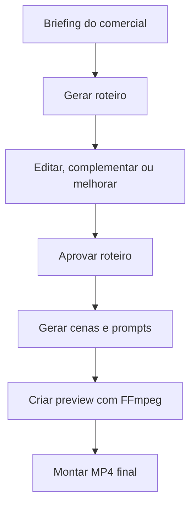

# Gal AI

> Estúdio **local-first** para criar comerciais curtos com IA, roteiro editável e fallback em FFmpeg.
>
> **Nome visual:** Gal AI  
> **Nome técnico/repositório:** galFlowAI


## Visão geral
O Gal AI organiza, em ambiente local, o fluxo de criação de comerciais curtos: briefing, roteiro, cenas, preview e exportação final em MP4.  
O foco é operação sem dependência obrigatória de cloud, com providers LLM locais e fallback por template.  
A interface principal é Gradio e a camada API é FastAPI para automações e integrações internas.

## Problema que resolve
Criar vídeo publicitário curto costuma exigir várias etapas manuais (ideia, roteiro, refinamento, cortes, prompts, montagem e render).  
O Gal AI reduz atrito operacional ao centralizar o fluxo técnico em uma stack local-first, com fallback para continuar funcionando mesmo sem LLM ativo.

## O que o Gal AI faz
| Funcionalidade | Status |
|----------------|--------|
| Criar projeto a partir de briefing | ✅ Implementado |
| Gerar roteiro com provider local ou template | ✅ Implementado |
| Editar, versionar e aprovar roteiro | ✅ Implementado |
| Dividir roteiro em cenas | ✅ Implementado |
| Gerar prompts por cena | ✅ Implementado |
| Criar preview/storyboard com FFmpeg | ✅ Implementado |
| Exportar MP4 final | ✅ Implementado |
| FastAPI para automação do fluxo | ✅ Implementado |
| API tests (7 endpoints) | ✅ Implementado |
| Script versioning (v1, v2...) | ✅ Implementado |
| Approval workflow | ✅ Implementado |
| WanGP/Wan2GP para geração avançada | 🔲 Planejado/Opcional |

## Fluxo do usuário


## Arquitetura
Gradio e FastAPI usam os mesmos serviços e adapters; a escolha do provider de roteiro passa por um roteador com fallback obrigatório para template local.

```mermaid
graph TD
    A[Gradio UI] --> B[Services Layer]
    C[FastAPI API] --> B
    B --> D[Providers: Template (fallback), GPT4All, LMStudio, etc.]
    B --> E[Adapters: WanGP, FramePack, FFmpeg]
    B --> F[Storage: Local File System]
    B --> G[Logging: JSON Structured]
```

## Funcionalidades Principais

### 1. Briefing → Roteiro
- Geração de roteiro a partir de briefing usando LLMs locais (GPT4All, LMStudio, KoboldCpp, llama.cpp) ou template local
- Versionamento automático de roteiros (v001, v002, ...)
- Edição manual com salvamento de versões

### 2. Melhoria de Roteiro
- **Melhorar**: Refinamento do roteiro mantendo o mesmo tom e objetivos
- **Complementar**: Adição de detalhes, exemplos, chamadas para ação
- **Mais Viral**: Otimização para engajamento e compartilhamento
- **Mais Premium**: Tom mais sofisticado, linguagem refinada
- **Mais Direto**: Abordagem direta, objetiva, focada em conversão

### 3. Geração de Vídeo
- Divisão automática do roteiro em cenas
- Geração de prompts para cada cena (positivo e negativo)
- Criação de preview/storyboard usando FFmpeg
- Exportação final em MP4 com configurações otimizadas para redes sociais

### 4. Observabilidade
- Central de logs em tempo real com filtros por nível e busca
- Visualização de console bruto
- Exportação de diagnóstico para troubleshooting
- Métricas de desempenho por provider e operação

## Fluxo de Trabalho Típico

1. **Briefing**: Usuário descreve o produto, público-alvo, objetivo e estilo desejado
2. **Roteiro**: Sistema gera roteiro inicial usando o melhor provider disponível (fallback para template)
3. **Edição**: Usuário edita, melhora, complementa ou aplica otimizações (viral, premium, direct)
4. **Aprovação**: Roteiro final é aprovado e versionado
5. **Preview**: Sistema gera preview do vídeo com os cenários e prompts
6. **Exportação**: Vídeo final em MP4 é renderizado e salvo

## Configuração

### Variáveis de Ambiente
As seguintes variáveis de ambiente são configuradas automaticamente nos scripts de inicialização:
- `PIP_CACHE_DIR=K:\AI_VIDEO_COMMERCIAL_STUDIO\cache\pip`
- `HF_HOME=K:\AI_VIDEO_COMMERCIAL_STUDIO\cache\huggingface`
- `TORCH_HOME=K:\AI_VIDEO_COMMERCIAL_STUDIO\cache\torch`
- `XDG_CACHE_HOME=K:\AI_VIDEO_COMMERCIAL_STUDIO\cache`
- `TEMP=K:\AI_VIDEO_COMMERCIAL_STUDIO\temp`
- `TMP=K:\AI_VIDEO_COMMERCIAL_STUDIO\temp`
- `OLLAMA_MODELS=K:\AI_VIDEO_COMMERCIAL_STUDIO\models\ollama`
- `GIT_PYTHON_GIT_EXECUTABLE=K:\AI_VIDEO_COMMERCIAL_STUDIO\envs\studio\Library\bin\git.exe`

### Estrutura de Pastas
```
projects\
  YYYYMMDD_HHMMSS_nome\
    brief\
    script\
    prompts\
    storyboard\
    renders\
    audio\
    final\
    logs\
    project.json
```

## Próximos Passos (Roadmap)

### H2 — Central de Logs Funcional (3 pts)
- [x] Já implementado: visualização de logs, filtros, busca, exportação de diagnóstico
- [ ] Melhorar: adicionar métricas de desempenho e correlação ponta-a-ponta

### H3 — Melhoria de Roteiro com LLMs Locais (5 pts)
- [x] Já implementado: botões Melhorar, Complementar, Mais Viral, Mais Premium, Mais Direto
- [ ] Melhorar: integrar providers locais reais (GPT4All, LMStudio) e remover dependência de Ollama

### H4 — Integração WanGP/Wan2GP (5 pts)
- [ ] Usar o motor WanGP/Wan2GP 1.3B já existente em `K:\AI_VIDEO_COMMERCIAL_STUDIO\engines\Wan2GP`
- [ ] Adaptador para geração de vídeo avançada com fallback para FFmpeg/template

### H5 — Templates de Vídeo para Redes Sociais (3 pts)
- [ ] Criar templates prontos para TikTok, Instagram Reels, YouTube Shorts
- [ ] Configurações automáticas de resolução, duração e taxa de quadros

### H6 — Sistema de Notificações (2 pts)
- [ ] Notificações desktop para conclusão de geração
- [ ] Integração com sistema de logs para alertas de erro

### H7 — Otimização de Performance (5 pts)
- [ ] Cache de prompts e resultados de LLM
- [ ] Processamento assíncrono de tarefas pesadas
- [ ] Limpeza automática de arquivos temporários

### H8 — Documentação e Tutoriais (3 pts)
- [ ] Vídeo tutorial passo a passo
- [ ] Guia de troubleshooting comum
- [ ] FAQ baseado em questões reais dos usuários

### H9 — Preparação para V2.0 (8 pts)
- [ ] API versão 2 com OpenAPI/Swagger
- [ ] WebSocket para atualização em tempo real
- [ ] Arquitetura de microsserviços locais (opcional)
- [ ] Containerização com Docker para facilitar deployment

## Licença
Este projeto é de uso privado e educacional. Não autoriza uso comercial sem permissão explícita.

---
*Última atualização: 05/05/2026*
*Versão: 1.0.0 - Gal AI Local First Edition*