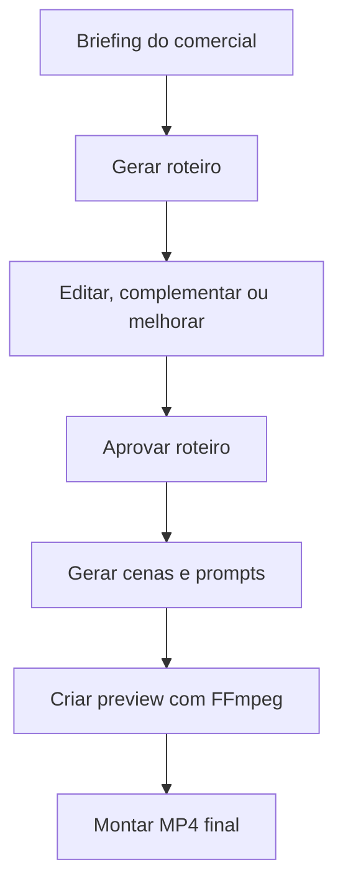
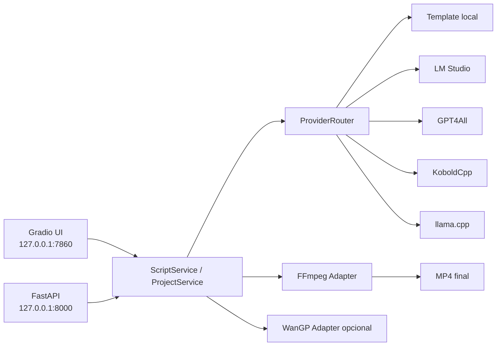
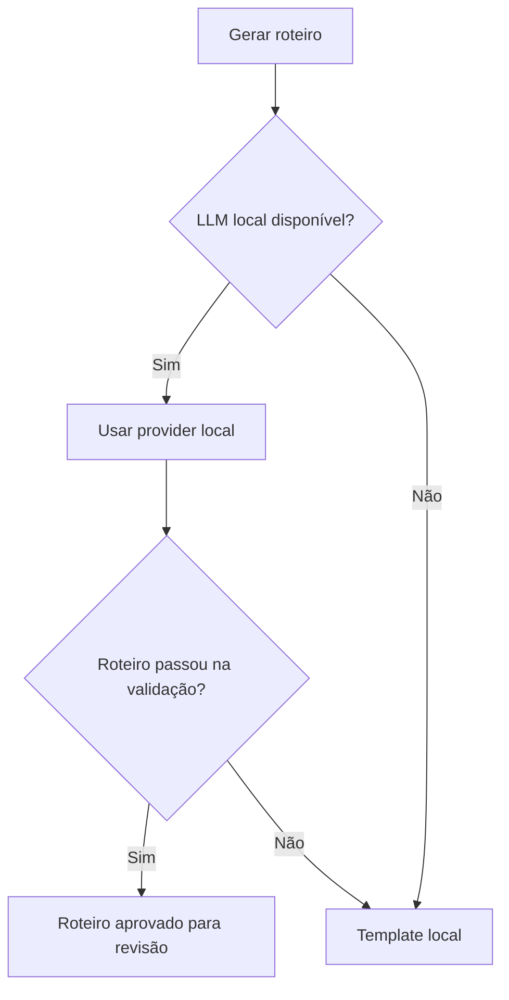

# Gal AI / galFlowAI

> Estúdio **local-first** para criar comerciais curtos com IA, roteiro editável e fallback em FFmpeg.


## Visão geral
O Gal AI organiza, em ambiente local, o fluxo de criação de comerciais curtos: briefing, roteiro, cenas, preview e exportação final em MP4.  
O foco é operação sem dependência obrigatória de cloud, com providers LLM locais e fallback por template.  
A interface principal é Gradio e a camada API é FastAPI para automações e integrações internas.

## Problema que resolve
Criar vídeo publicitário curto costuma exigir várias etapas manuais (ideia, roteiro, refinamento, cortes, prompts, montagem e render).  
O Gal AI reduz atrito operacional ao centralizar o fluxo técnico em uma stack local-first, com fallback para continuar funcionando mesmo sem LLM ativo.

## O que o Gal AI faz
| Funcionalidade | Status |
|---|---|
| Criar projeto a partir de briefing | Implementado |
| Gerar roteiro com provider local ou template | Implementado |
| Editar, versionar e aprovar roteiro | Implementado |
| Dividir roteiro em cenas | Implementado |
| Gerar prompts por cena | Parcial |
| Criar preview/storyboard com FFmpeg | Implementado |
| Exportar MP4 final | Implementado |
| FastAPI para automação do fluxo | Implementado |
| WanGP/Wan2GP para geração avançada | Planejado/Opcional |

## Fluxo do usuário


## Arquitetura
Gradio e FastAPI usam os mesmos serviços e adapters; a escolha do provider de roteiro passa por um roteador com fallback obrigatório para template local.



## Motores de roteiro
| Motor | API key | Internet | Status no projeto | Uso recomendado |
|---|---|---|---|---|
| Template local | Não | Não | Implementado (fallback obrigatório) | Continuidade do fluxo |
| LM Studio local | Não | Só para baixar modelo | Implementado | Melhor qualidade local |
| GPT4All local | Não | Só para setup/modelo | Implementado | Integração Python local |
| KoboldCpp local | Não | Só para setup/modelo | Implementado | Execução portátil |
| llama.cpp local | Não | Só para setup/modelo | Implementado | Controle fino técnico |
| GPT compatível local | Depende do endpoint | Depende | Parcial | Integração customizada |
| Ollama | Não | Não | Opcional (não obrigatório) | Apenas se já estiver no ambiente |

## Fallbacks


- O app não deve quebrar por ausência de LLM local.
- `TemplateProvider` é fallback obrigatório para roteiro.
- FFmpeg é fallback obrigatório na montagem de vídeo.
- WanGP é opcional e não bloqueia o fluxo base.

## Requisitos
### Obrigatórios
- Windows 10/11 (alvo principal atual).
- Python 3.10+ no ambiente do projeto.
- Dependências Python (`gradio`, `fastapi`, `uvicorn`, etc.).
- FFmpeg disponível no ambiente.

### Opcionais
- GPU NVIDIA para aceleração.
- WanGP/Wan2GP.
- LM Studio, GPT4All, KoboldCpp, llama.cpp.
- TTS local.

> Recomendado: manter espaço livre suficiente para modelos e arquivos de vídeo.

## Instalação rápida
```bat
cd /d K:\AI_VIDEO_COMERCIAL_STUDIO\opencodegalpasta
scripts\start_app_debug.bat
```

## Como subir a interface Gradio
- Porta padrão: `127.0.0.1:7860`.
- Script recomendado: `scripts\start_app_debug.bat`.
- Comando alternativo: `python app/main.py`.
- Verifique se subiu acessando `http://127.0.0.1:7860`.

## Como subir FastAPI
`app/api.py` existe e está ativo no repositório.

```bat
python -m uvicorn app.api:app --host 127.0.0.1 --port 8000
```

- URL base: `http://127.0.0.1:8000`
- Swagger: `http://127.0.0.1:8000/docs`
- Script auxiliar: `scripts\start_fastapi.bat`

## Como usar
1. Abrir a interface.
2. Escrever briefing.
3. Escolher motor de roteiro.
4. Gerar roteiro.
5. Editar/complementar/melhorar.
6. Aprovar roteiro.
7. Gerar cenas.
8. Criar preview.
9. Exportar MP4.

## Estrutura essencial do projeto
```text
app/
  main.py
  api.py
  services/
  adapters/
  pipeline/
scripts/
docs/
frontend/
tests/
projects/ *(criado em runtime)*
logs/ *(criado em runtime)*
```

## Troubleshooting
### `ERR_CONNECTION_REFUSED` em `127.0.0.1:7860`
- Causa provável: app não subiu ou caiu na inicialização.
- Verificação: `netstat -ano | findstr :7860`
- Ação: reiniciar `scripts\start_app_debug.bat` e revisar terminal/log.

### `FFmpeg` não encontrado
- Causa provável: binário ausente no PATH.
- Ação: instalar/configurar FFmpeg e reiniciar sessão.

### Nenhum motor local ativo
- Causa provável: serviços LLM locais desligados.
- Ação: usar Template local (fallback) ou iniciar LM Studio/GPT4All/KoboldCpp/llama.cpp.

### WanGP não encontrado
- Causa provável: engine opcional não instalada.
- Ação: seguir com FFmpeg fallback (fluxo base continua).

### Travamento por modelo pesado
- Causa provável: VRAM insuficiente para o modelo carregado.
- Ação: usar modelo menor e processar uma cena por vez.

## Roadmap
### V2
- FastAPI interno.
- Roteiro editável/versionado.
- Providers locais + TemplateProvider.
- UI PT-BR.
- Fallback FFmpeg.

### V2.5
- Evolução de frontend (React/TypeScript, se adotado).
- Timeline visual.
- Editor avançado.

### V3
- Launcher/supervisor em Go.
- Worker robusto e watchdog.
- Empacotamento Windows.

## Limitações conhecidas
- Geração avançada de vídeo depende da instalação/configuração local de engines opcionais.
- Modelos locais devem ser instalados pelo usuário.
- GPUs com 6 GB VRAM exigem presets leves.
- APIs externas não são obrigatórias no fluxo base.
- O projeto não é SaaS.

## Contribuição
- Abra issue com contexto técnico.
- Crie branch com escopo claro.
- Rode testes/scripts de validação antes de PR.
- Mantenha compatibilidade local-first e evite dependências pesadas sem justificativa.

## Documentação relacionada
- [FastAPI V2](docs/FASTAPI_V2.md)
- [Roteiro editável (principal)](docs/ROTEIRO_EDITAVEL.md)
- [Script editable (compatibilidade)](docs/SCRIPT_EDITABLE.md)
- [LLM local sem API key](docs/LLM_LOCAL_SEM_API_KEY.md)
- [Troubleshooting](docs/TROUBLESHOOTING.md)
- [Arquitetura](docs/ARQUITETURA.md)

## Licença
Licença ainda não definida.
