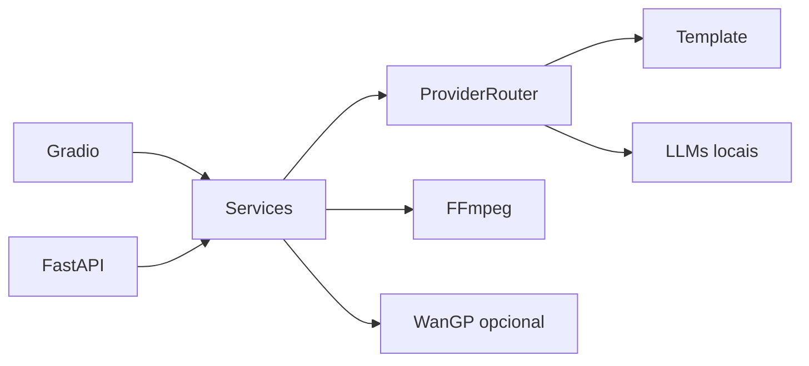

# Arquitetura

O Gal AI possui duas entradas principais (Gradio e FastAPI), reutilizando a mesma camada de serviços.

## Camadas
- **Entrada:** `app/main.py` e `app/api.py`
- **Serviços:** `app/services/`
- **Adapters:** `app/adapters/`
- **Pipeline:** `app/pipeline/`
